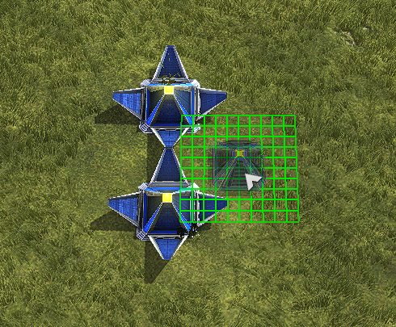
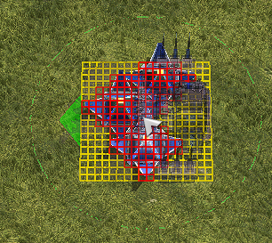

### Squares

The map is divided into a **discrete grid of 8x8 elmo squares**. Most terrain-related things (heightmap, parts of pathing, resource map aka metalmap, typemap, building masks, radar coverage...) work on these squares. Some of those are discretized further into 16x16 elmo squares, i.e. a 2x2 box of basic game squares. In particular, unit footprints are defined in big squares (also called a footprint square for that reason).

### Footprint

Buildings and mobile units have their footprint (in other words, size on the building grid) defined differently. **Mobile units define it in their move def**, and it has to be a square. In theory you can define a footprint in the unit def, but this is just used for construction.

**Buildings define it in their unit def**. This can be a rectangle, and you can define parts of the footprint to allow pathing (useful for factory exit yards), buildable (for when a building doesn't occupy the whole square), change meaning when the unit activates (for some sort of opening animation) or require a geothermal vent underneath. Such definition is called a **yardmap, and consists of a string arranged visually to depict the building**, with characters conveying some meaning as listed in the table at the bottom.

For example, consider the following yardmap. The `o` depicts the actual body area, while `y` is open space, and it corresponds to a diamond shape within the 5x5 footprint:

```
yyoyy
yoooy
ooooo
yoooy
yyoyy
```

And here's what happens if you try to place another of the same type on top. Notice how the `y` area does not produce conflicts.



Here's how it looks if you try to place things on top:



Essentially, the building is shaped like this (mock-up):


### Yardmap characters

Basic characters:

| letter | buildable if active? | pathable if active? | buildable if INactive? | pathable if INactive? | stackable? | need geo? |
| ------ | -------------------- | ------------------- | ---------------------- | --------------------- | ---------- | --------- |
| o      | ❌                   | ❌                  | ❌                     | ❌                    | ❌         | ❌        |
| y      | ✅                   | ✅                  | ✅                     | ✅                    | ❌         | ❌        |
| c      | ✅                   | ✅                  | ❌                     | ❌                    | ❌         | ❌        |
| g      | ❌                   | ❌                  | ❌                     | ❌                    | ❌         | ✅        |
| i      | ❌                   | ❌                  | ✅                     | ✅                    | ❌         | ❌        |
| j      | ❌                   | ❌                  | ❌                     | ❌                    | ✅         | ✅        |
| s      | ❌                   | ❌                  | ❌                     | ❌                    | ✅         | ❌        |
| b      | ✅                   | ❌                  | ✅                     | ❌                    | ❌         | ❌        |
| u      | ❌                   | ✅                  | ❌                     | ✅                    | ❌         | ❌        |
| e      | ❌                   | ⚠️ exit only        | ❌                     | ⚠️ exit only          | ❌         | ❌        |

Others:

- `h` has a special meaning - it **has to be the first letter and means a high resolution yardmap**,
  i.e. there have to be 4x more characters and each will correspond to a "regular" 8x8 elmo game square instead of the larger 16x16 elmo footprint square.
- `w`, `x`, `f`: deprecated, same as `o`.
- **whitespace is ignored**, which you can use to neatly **arrange the rectangle visually**.
- anything else is ignored as well but may be used in the future.

### Typemaps and speed mod classes

One of the metadata associated with game squares is terrain type. A map can define (and a game can in theory later tweak) up to 256 types of terrain with their own traits. The first built-in terrain trait is hardness, which is a multiplier on weapon terrain deformation (cratering). The other is speed multipliers for unit movement classes. There are four movement classes: "kbot", "tank", "hover" and "ship". Here are their characteristics:

- **hovercraft** can move on the ground and on water surface.
- **tank** and **kbot** can move on the ground and optionally underwater, on the seafloor. The only difference between them is which typemap speed multiplier affects them. Keep in mind they are essentially just two arbitrary classes, so you could for example replicate SC2 style creep movement speed bonuses by having the creep as its own terrain type that applies a multiplier for "tanks", then set Zerg units to the "tank" movetype and everything else as "kbots".
- **ships** can only move in water. Ships that can "walk onto land", like SupCom Cybran Siren or RA3 Soviet Stingray have to be set as hovercraft!
- aircraft, and units of the above classes being moved manually via Lua, do not use any terrain-based speed multipliers.
- the engine pathfinder knows about these speed multipliers (including x0 multiplier, which is not passable) and will take them into account as appropriate.

Lua can read terrain type, so you could use it to apply metadata to terrain (think healing ground, territory ownership or triggers), but keep in mind that for applying any sort of gameplay mechanics it's usually more performant to just manually poll a rectangular zone or such. Also there don't seem to be any conventions as to what ID represents what terrain type, so games and maps would need to pay a lot of attention to stay self-consistent and not break compatibility. It's probably best to avoid doing anything beyond the built-in engine typemap behaviour.
